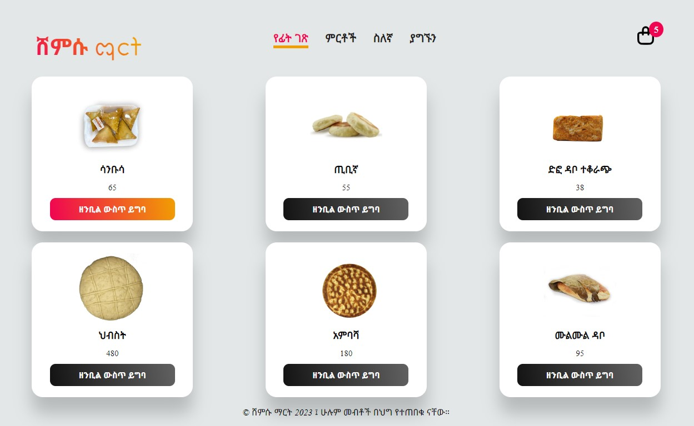
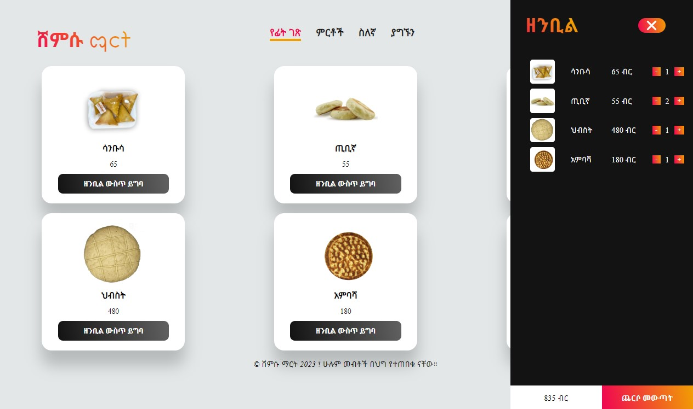

## How to Build a Shopping Cart with Pure JavaScript and Beautiful UI/UX
###### In this video tutorial, we will show you how to build a fully functional shopping cart using pure JavaScript. We will create a beautiful and user-friendly UI using CSS and HTML.

##### The shopping cart will have the following features:
- Add items to the cart
- Remove items from the cart
- Update the quantity of items in the cart
- Calculate the total price of the items in the cart

We will also learn how to handle errors, such as when an item is not found in the store or when the user enters an invalid quantity.

 

#### What You'll Learn
- How to create a basic HTML structure for the shopping cart
- How to create a fully functional shopping cart using pure JavaScript
- How to create a beautiful and user-friendly UI using CSS and HTML
- How to add JavaScript to the shopping cart to add, remove, and update items
- How to handle errors, such as when an item is not found in the store or when the user enters an invalid quantity

#### Prerequisites
- Basic knowledge of HTML and CSS
- Some familiarity with JavaScript

* Use this css below for reference
```css
/* Order List */
.prodCartList ul {
    list-style: none;
}
.prodCartList li {
    display: grid;
    grid-template-columns: repeat(4, 1fr);
    row-gap: 10px;
    color: white;
    padding-bottom: 10px;
}
.prodCartList li div {
    display: flex;
    align-items: center;
}
.prodCartList li img {
    width: 60%;
    border-radius: 5px;
}
.prodCartList li button {
    background: linear-gradient(80deg, var(--primary-color), var(--secondary-color) 100%);
    border: none;
    cursor: pointer;
    color: white;
}
.prodCartList .count {
    margin: 0 10px;
}
```
After inserting this css to access `prodCartList` class inside the `index.html` page cart div apply the following JavaScript code to implement the functionality.

```js
let prod;
let listCarts  = [];

// Add this line inside the loop code above append function
    newDiv.innerHTML = `
        
        <div class='title'>${products[x].name}</div>
        <div class='price'>${products[x].price} ETB</div>
        <button onclick="addToCart(${x})">Add to Cart</button>`;

// This function called when we click Add to Cart: button with key parameter
function addToCart(key){
    if(listCarts[key] == null){
        listCarts[key] = prod[key];
        listCarts[key].quantity =1;
    } else {
        listCarts[key].quantity +=1;
    }

    // this function calls a process which refresh product list to cart menu
    reloadCart();
}

// Reload cart menu slide
function reloadCart(){
    prodCartList.innerHTML = "";
    let count = 0;
    let totalPrice = 0;

    listCarts.forEach((item, key) => {
        totalPrice = totalPrice + (item.quantity * item.price);
        count = count + item.quantity;
        if(item != null){
            let newDiv = document.createElement("li");
            newDiv.innerHTML = `
                    <div></div>
                    <div>${item.name}</div>
                    <div>${item.price} ብር</div>
                    <div>
                        <button onclick="updateQuantity(${key}, ${item.quantity -1})">-</button>
                        <div class='count'>${item.quantity}</div>
                        <button onclick="updateQuantity(${key}, ${item.quantity +1})">+</button>
                    </div>`;
            prodCartList.appendChild(newDiv);
        }
    });

    quantity.innerHTML = count;
    total.innerHTML = `${totalPrice.toLocaleString()} ብር`;
}

// Updates the product quantity inside the cart menu
function updateQuantity(key, quantity){
    if(quantity == 0){
        delete listCarts[key];
    } else {
        listCarts[key].quantity = quantity;
    }
    reloadCart();
}

```